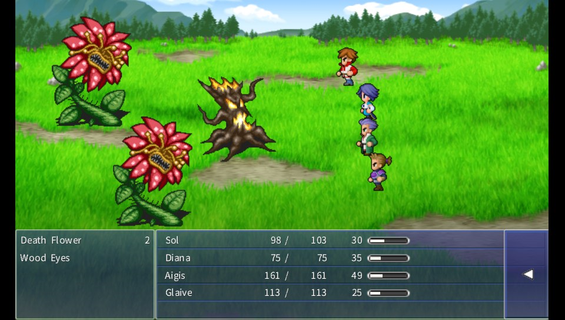

# Final Fantasy Dimensions Vita

<p align="center"></p>

This is a wrapper/port of <b>Final Fantasy Dimensions</b> for the *PS Vita*.

The port works by loading the official Android ARMv6 executables in memory, resolving its imports with native functions and patching it in order to properly run.
By doing so, it's basically as if we emulate a minimalist Android environment in which we run natively the executable as is.

## Changelog

### v.1.2

- Fixed an issue causing the game to crash during the final ending scene.

### v.1.1

- Mitigated crashing issues due to memleaks. When game starts stuttering when casting spells and starting battles, it's suggested to save as soon as possible and restart the app.

### v.1.0

- Initial release.

## Note

- The port has been tested with v.1.1.3 of the game.
- Once in worldmap, it's suggested to go in Menu -> Config -> Controls and set it to Fix. By doing this, it will be possible to use physical buttons to move on the map, to interact with objects (Cross) and to open the Menu (Triangle).

## Setup Instructions (For End Users)

In order to properly install the game, you'll have to follow these steps precisely:

- Install [kubridge](https://github.com/TheOfficialFloW/kubridge/releases/) and [FdFix](https://github.com/TheOfficialFloW/FdFix/releases/) by copying `kubridge.skprx` and `fd_fix.skprx` to your taiHEN plugins folder (usually `ux0:tai`) and adding two entries to your `config.txt` under `*KERNEL`:
  
```
  *KERNEL
  ux0:tai/kubridge.skprx
  ux0:tai/fd_fix.skprx
```

**Note** Don't install fd_fix.skprx if you're using rePatch plugin

- **Optional**: Install [PSVshell](https://github.com/Electry/PSVshell/releases) to overclock your device to 500Mhz.
- Install `libshacccg.suprx`, if you don't have it already, by following [this guide](https://samilops2.gitbook.io/vita-troubleshooting-guide/shader-compiler/extract-libshacccg.suprx).
- Obtain your copy of *Final Fantasy Dimensions* legally for Android in form of an `.apk` file and an obb. [You can get all the required files directly from your phone](https://stackoverflow.com/questions/11012976/how-do-i-get-the-apk-of-an-installed-app-without-root-access) or by using an apk extractor you can find in the play store.
- Open the apk with your zip explorer and extract the file `libjniproxy.so` from the `lib/armeabi` folder to `ux0:data/ffd`. 
- Extract the folder `res` inside `ux0:data/ffd`.
- Extract the `obb` file in `ux0:data/ffd` and rename the file `main.obb`.

## Build Instructions (For Developers)

In order to build the loader, you'll need a [vitasdk](https://github.com/vitasdk) build fully compiled with softfp usage.  
You can find a precompiled version here: https://github.com/vitasdk/buildscripts/actions/runs/1102643776.  
Additionally, you'll need these libraries to be compiled as well with `-mfloat-abi=softfp` added to their CFLAGS:

- [SoLoud](https://github.com/vitasdk/packages/blob/master/soloud/VITABUILD)

- [libmathneon](https://github.com/Rinnegatamante/math-neon)

  - ```bash
    make install
    ```

- [vitaShaRK](https://github.com/Rinnegatamante/vitaShaRK)

  - ```bash
    make install
    ```

- [kubridge](https://github.com/TheOfficialFloW/kubridge)

  - ```bash
    mkdir build && cd build
    cmake .. && make install
    ```

- [vitaGL](https://github.com/Rinnegatamante/vitaGL)

  - ````bash
    make SOFTFP_ABI=1 NO_DEBUG=1 install
    ````

After all these requirements are met, you can compile the loader with the following commands:

```bash
mkdir build && cd build
cmake .. && make
```

## Credits

- TheFloW for the original .so loader.
- frangarcj for [FF5 Vita](https://github.com/frangarcj/ff5_vita) from which several code snippets had been taken since the two games share the engine.
- withLogic for testing the homebrew and providing screenshots.
- Hans for testing the homebrew.
- Brandonheat8 for the Livearea assets.
